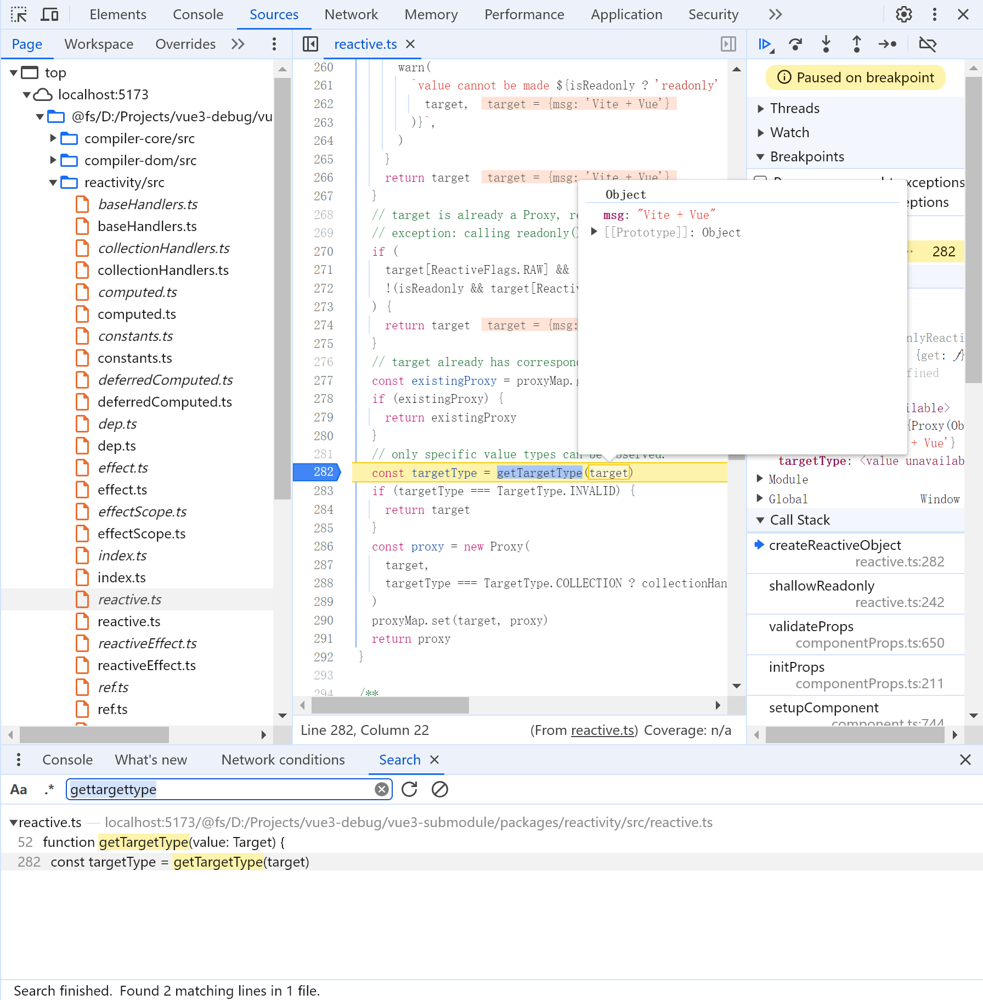

# 学习 vue 源码

**目的：** 用源码仓库取代压缩依赖，通过断点调试，更好的理解和学习框架 vue

**方式：** 首先通过 git summodule 关联 vue 源码仓库，然后修改 vite 配置，使用源码

## 快速上手

control + shift + B，选择任务 Install vue3(使用 vscode 任务配置，执行安装依赖)

使用 vscode 运行 F5 本地项目

### 调试 vue 源码断点

使用 chrome 浏览器的 F12 开发者工具：

- 切换到选项卡 Source，在 Page 的 reactivity/dist 寻找源码文件
- 使用 ctrl + shift + F 全局搜索关键词，点击搜索结果也能跳到源码位置



里面的 "Vite + Vue" 出自 App.vue 文件

```vue
<template>
  <div>
    <a href="https://vitejs.dev" target="_blank">
      
    </a>
    <a href="https://vuejs.org/" target="_blank">
      
    </a>
  </div>
  <!-- Vite + Vue -->
  <HelloWorld msg="Vite + Vue" />
</template>
```

## 仓库从无到有

### 目录结构

```scss
/vue3-debug
│
├── vue3-submodule
│   ├── packages
│   │   └── vue  (Vue 3 源码或子模块内容)
│   ├── ...   (其他可能的子模块内容)
│   └── README.md
│
└── vite-vue3-app
    ├── src
    │   ├── components
    │   │   └── App.vue
    │   └── main.js
    ├── public
    │   └── index.html
    ├── vite.config.js
    ├── package.json
    └── README.md
```

### 命令流程

```bash
# 创建项目 && 进入项目 && 初始化git仓库
mkdir vue3-debug && cd vue3-debug && git init

# vite 安装 vue3(简单点，不安装vue-ts)
npm create vite@latest vite-vue3-app -- --template vue

# 使用的是远程仓库 URL，添加 vue3 子模块
git submodule add https://github.com/vuejs/core.git vue3-submodule

# 修改 vite.congfig.js 配置文件(见下)

# vue项目安装依赖并构建
cd vue3-submodule
pnpm install
npm run build

# 运行本地项目
cd vite-vue3-app
npm uninstall vue
npm install
pnpm install --prefix ../vue3-submodule
npm run dev
```

### 修改 vite.config.js 配置文件

```diff
// vite.config.js

import { defineConfig } from 'vite';
import vue from '@vitejs/plugin-vue';
+ import path from 'path';

// https://vitejs.dev/config/
export default defineConfig({
  plugins: [vue()],
+ resolve: {
+   alias: {
+     vue: path.resolve(__dirname, '../vue3-submodule/packages/vue/src'),
+     '@vue/runtime-dom': path.resolve(
+       __dirname,
+       '../vue3-submodule/packages/runtime-dom/src'
+     ),
+     '@vue/runtime-core': path.resolve(
+       __dirname,
+       '../vue3-submodule/packages/runtime-core/src'
+     ),
+     '@vue/reactivity': path.resolve(
+       __dirname,
+       '../vue3-submodule/packages/reactivity/src'
+     ),
+     '@vue/shared': path.resolve(
+       __dirname,
+       '../vue3-submodule/packages/shared/src'
+     ),
+     '@vue/compiler-dom': path.resolve(
+       __dirname,
+       '../vue3-submodule/packages/compiler-dom/src'
+     ),
+     '@vue/compiler-core': path.resolve(
+       __dirname,
+       '../vue3-submodule/packages/compiler-core/src'
+     ),
+     '@vue/compiler-sfc': path.resolve(
+       __dirname,
+       '../vue3-submodule/packages/compiler-sfc/src'
+     ),
+     '@vue/compiler-ssr': path.resolve(
+       __dirname,
+       '../vue3-submodule/packages/compiler-ssr/src'
+     ),
+   },
+ },
+ define: {
+   // 环境标志
+   __DEV__: process.env.NODE_ENV !== 'production', // 开发环境标志
+   __TEST__: process.env.NODE_ENV === 'test', // 测试环境标志

+   // 兼容模式和 SSR 标志
+   __COMPAT__: false, // Vue 2.x 兼容模式标志，根据需要设置为 true 或 false
+   __SSR__: false, // 服务端渲染标志，根据需要设置为 true 或 false

+   // 版本信息
+   __VERSION__: JSON.stringify(
+     require('../vue3-submodule/packages/vue/package.json').version // 从 Vue 包的 package.json 中读取版本号
+   ),

+   // 特性标志
+   __FEATURE_OPTIONS_API__: true, // 启用 Options API 特性
+   __FEATURE_SUSPENSE__: true, // 启用 Suspense 特性
+   __ESM_BUNDLER__: true, // ESM 捆绑器标志，根据需要设置为 true 或 false
+   __BROWSER__: true, // 浏览器环境标志，根据需要设置为 true 或 false

+   // 生产环境开发工具标志
+   __VUE_PROD_DEVTOOLS__:
+     process.env.NODE_ENV === 'production' ? 'false' : 'true', // 生产环境下禁用开发工具

+   // 生产环境水合不匹配详情标志
+   __VUE_PROD_HYDRATION_MISMATCH_DETAILS__: 'false', // 禁用生产环境中的水合不匹配详情
+   __FEATURE_PROD_DEVTOOLS__:
+     process.env.NODE_ENV === 'production' ? 'false' : 'true', // 生产环境下禁用开发工具
+   __FEATURE_PROD_HYDRATION_MISMATCH_DETAILS__: 'false', // 禁用生产环境中的水合不匹配详情
+ },
});
```
